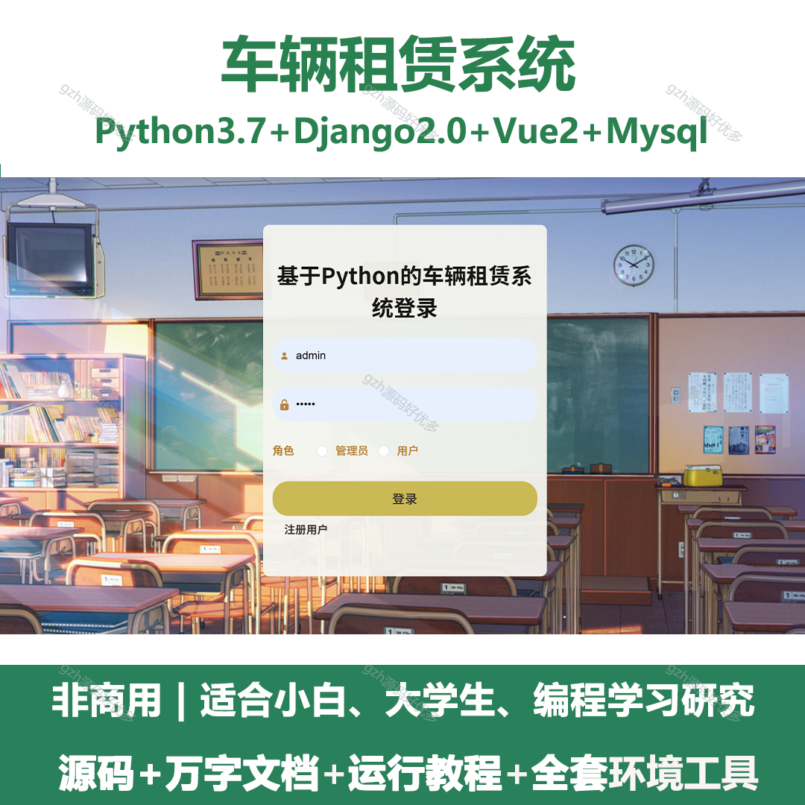
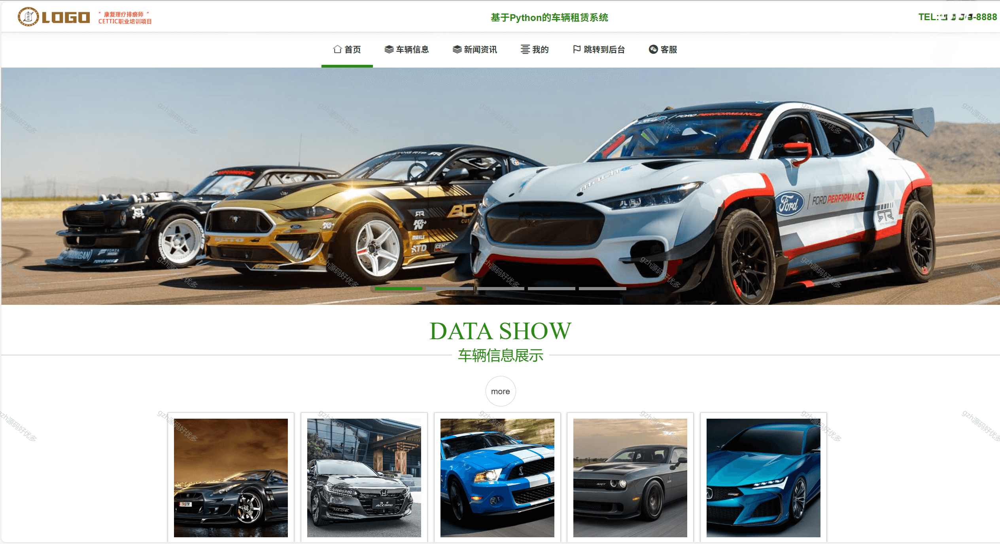
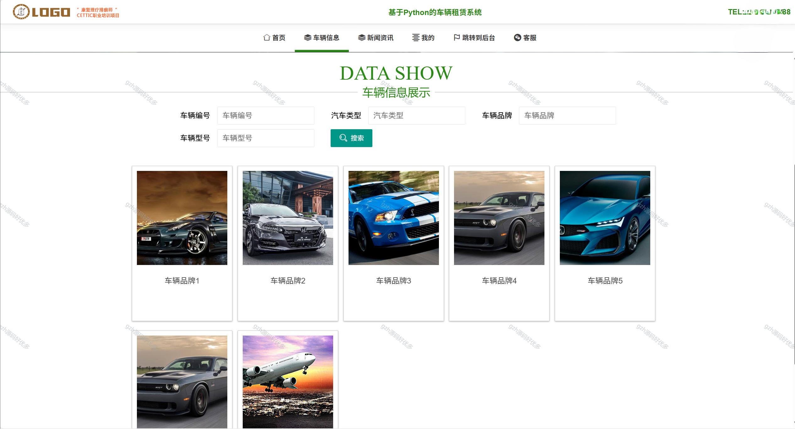
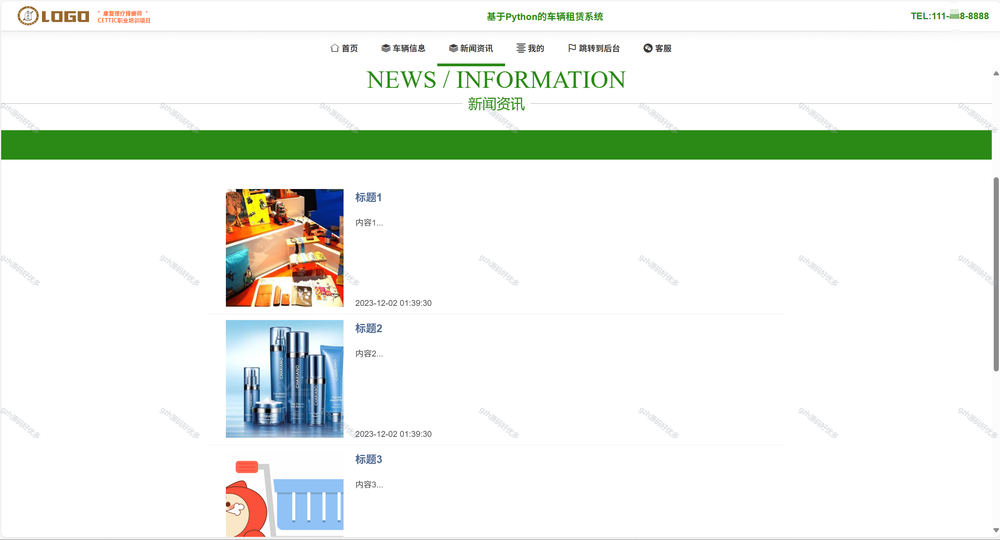
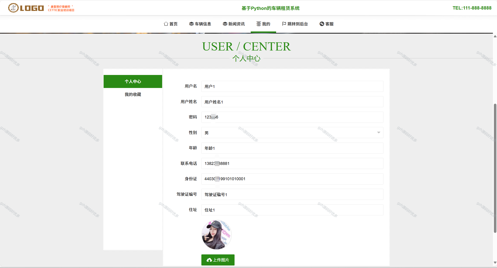
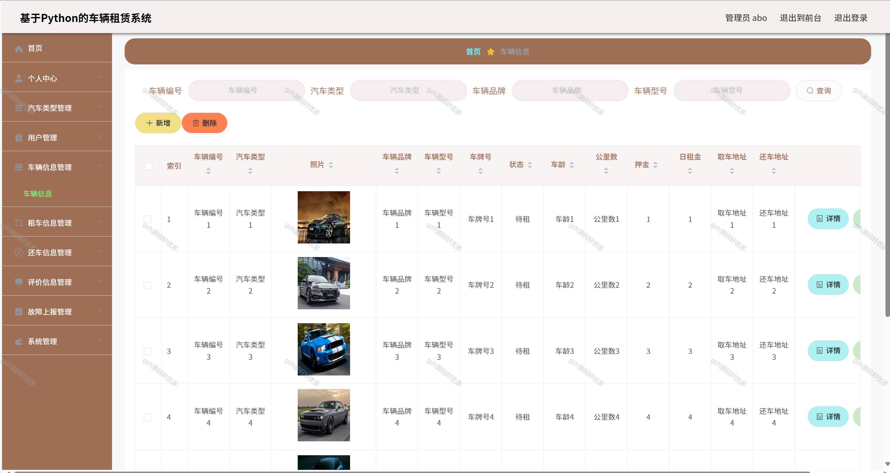
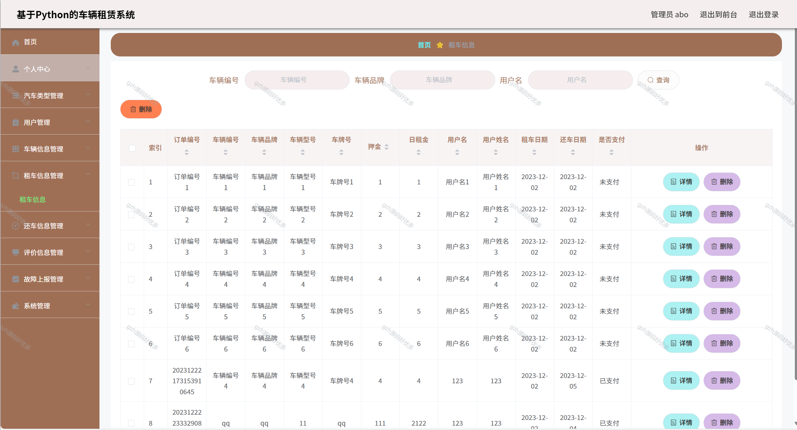
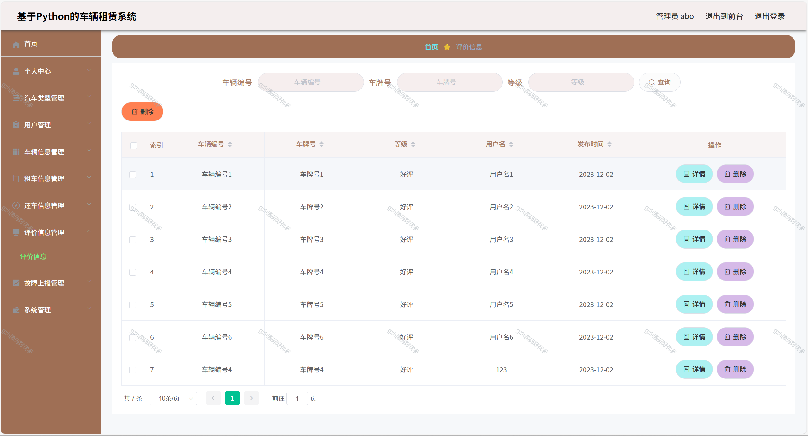
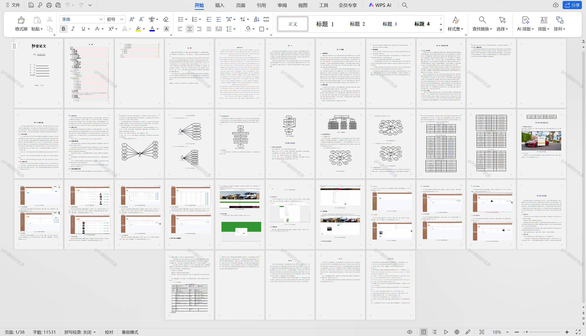

# python079
python079基于Python+Django的车辆租赁系统+LW
 
## 查看主页获取源码

### 一、关键词
汽车租赁系统，车辆租借系统，租车系统

### 二、作品包含
源码+数据库+设计文档万字+全套环境和工具资源+本地部署教程

### 三、项目技术
前端技术：Vue2.0、Element-ui、Layui
后端技术：Python3.7、Django2.0

### 四、运行环境（以下版本亲测，其他版本兼容性请自行测试）
开发工具：PyCharm + VSCODE

数据库：MySQL5.7（最低要5.7版本）

数据库管理工具：Navicat10+

Python：Python3.7

前端Nodejs：14

浏览器：谷歌浏览器

### 五、项目介绍
项目编号：python079

根据现实的需求来实现网上租车系统网络化的管理，各类信息有序地进行存储，进入网上租车系统页面之后，方可开始操作主控界面，主要功能包括管理员：首页、个人中心、用户管理、汽车类型管理、车辆信息管理、租车信息管理、还车信息管理、评价信息管理、故障上报管理、系统管理。用户前台：首页、车辆信息、新闻资讯、我的、跳转到后台、客服。用户后台：首页、个人中心、租车信息管理、还车信息管理、评价信息管理、故障上报管理、我的收藏管理等功能。

### 六、运行截图

